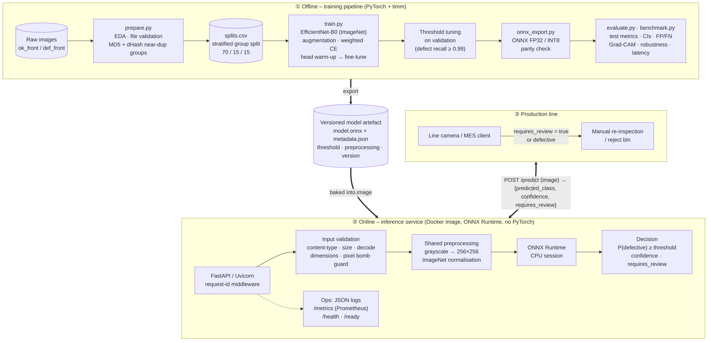
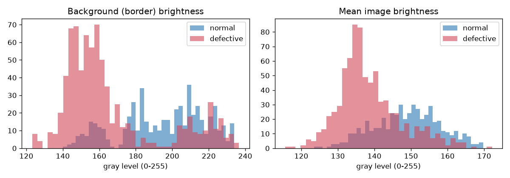
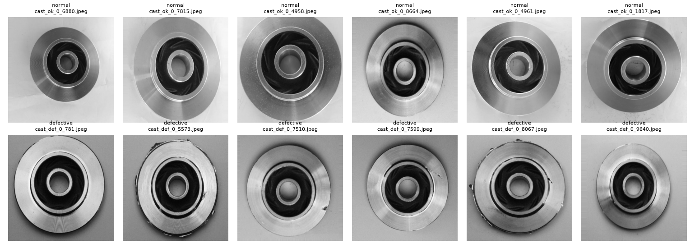
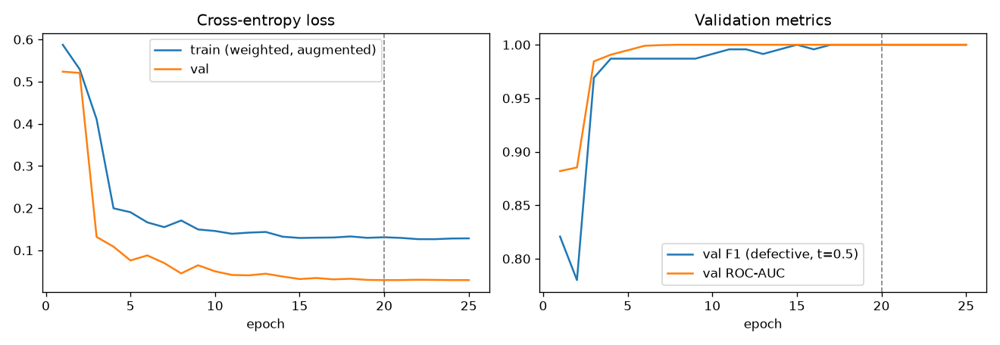
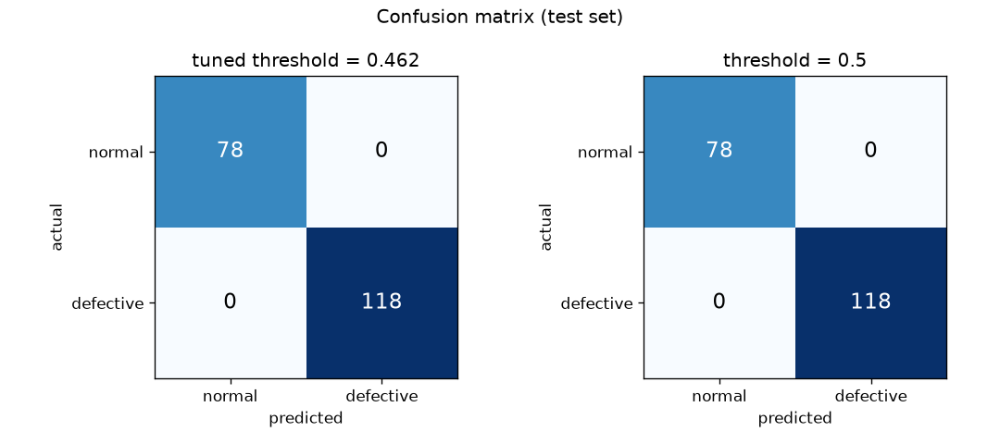
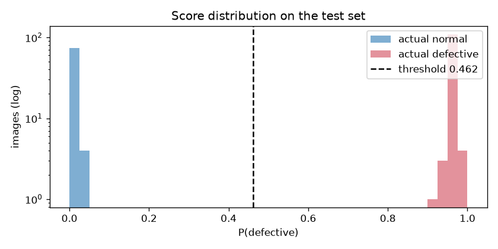
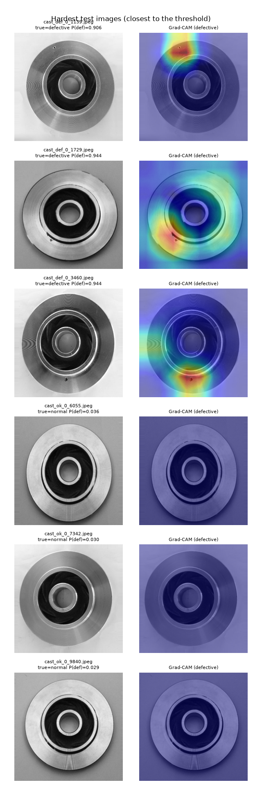
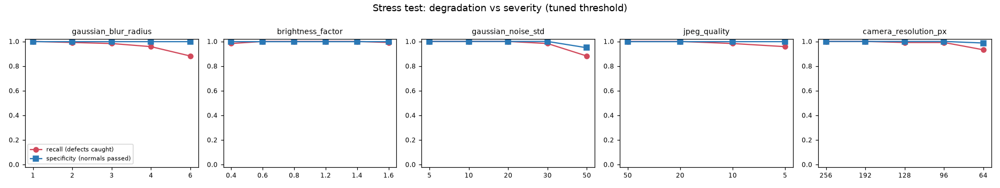
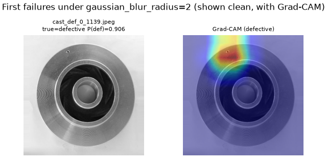

# Visual Defect Detection – normal vs defective parts

A production-ready computer-vision system that inspects images of manufactured parts and classifies each one
as **normal** or **defective**. It covers the full lifecycle:

* dataset analysis
* leakage-safe splitting
* transfer learning
* class-imbalance handling
* threshold tuning
* evaluation with error analysis
* ONNX export
* a validated, logged, monitored **FastAPI** inference service, packaged as a small **Docker** image

<p align="center"></p>

| | |
|---|---|
| **Shipped model** | EfficientNet-B0 (ImageNet pretrained, fine-tuned), ONNX FP32, 16.5 MB: [`models/efficientnet_b0/`](models/efficientnet_b0) |
| **Test set (196 held-out images)** | precision **1.000**, recall **1.000**, F1 **1.000**, 0 FP / 0 FN. Exact 95 % CI: recall ≥ 0.969, specificity ≥ 0.954 |
| **Latency (4 vCPU Xeon)** | 4.8 ms model + 1.7 ms preprocessing per image. **12.9 ms p50** end-to-end over HTTP in Docker |
| **Serving image** | `python:3.11-slim` + ONNX Runtime + FastAPI (no PyTorch), 146 MB compressed |

> **Read the results with care.** A perfect score on 196 images is a property of this dataset (one product,
> one camera, a fixed set-up), not a promise for a new line. The [error analysis](#7-error-analysis--model-weaknesses)
> therefore stress-tests the model to find where it breaks. It also shows the model does **not** rely on
> a lighting shortcut that exists in the data.

---

## Contents
1. [Quick start](#1-quick-start)
2. [Dataset & strategy](#2-dataset--strategy)
3. [Model approach & why this architecture](#3-model-approach)
4. [Class imbalance](#4-class-imbalance)
5. [Training](#5-training)
6. [Evaluation results](#6-evaluation-results)
7. [Error analysis & model weaknesses](#7-error-analysis--model-weaknesses)
8. [Accuracy / latency / size trade-offs](#8-accuracy--latency--size-trade-offs)
9. [Inference API](#9-inference-api)
10. [Example predictions](#10-example-predictions)
11. [Deployment & operations](#11-deployment--operations)
12. [Project structure](#12-project-structure)
13. [Known limitations & next steps](#13-known-limitations--next-steps)

---

## 1. Quick start

### Run the API (no training needed: the trained model is in the repo)

```bash
# Docker (recommended)
docker build -f docker/Dockerfile -t defect-detection-api:1.0.0 .
docker run --rm -p 8000:8000 defect-detection-api:1.0.0
# or: docker compose up --build

curl -F "file=@examples/images/defective__cast_def_0_6112.jpeg" http://localhost:8000/predict
```

```json
{
  "request_id": "8f0c1d2e3a4b5c6d",
  "filename": "defective__cast_def_0_6112.jpeg",
  "predicted_class": "defective",
  "confidence": 0.980607,
  "probabilities": {"normal": 0.019393, "defective": 0.980607},
  "defect_probability": 0.980607,
  "threshold": 0.461697,
  "requires_review": false,
  "quality_warnings": [],
  "model_version": "efficientnet_b0-20261005-f93e5afb",
  "inference_ms": 12.4
}
```

Interactive OpenAPI docs: <http://localhost:8000/docs>.

Without Docker:

```bash
python -m venv .venv && source .venv/bin/activate
pip install -r requirements/serve.txt && pip install --no-deps -e .
DD_MODEL_DIR=models/efficientnet_b0 uvicorn defect_detection.api.main:app --port 8000
# CLI inference without a server:
python -m defect_detection.predict --model-dir models/efficientnet_b0 examples/images/
```

### Reproduce everything (data → training → evaluation)

```bash
pip install torch torchvision --index-url https://download.pytorch.org/whl/cpu   # or a CUDA build
make install          # requirements/dev.txt + editable package
make all              # data, prepare, train (x2), export, evaluate, benchmark, examples
make test             # 36 unit / API tests
```

| step | command | output |
|---|---|---|
| dataset | already in the repo (`make data` re-downloads it if missing) | `data/raw/{def_front,ok_front}` (1,300 images) |
| analysis + split | `make prepare` | `data/splits.csv`, `reports/data_analysis.json`, `reports/figures/data/` |
| ImageNet weights | `make weights` | `weights/*.pth` |
| train | `make train` / `make train-alt` | `runs/<model>/best.pt`, curves, logs |
| export | `make export` | `models/<model>/{model.onnx, model.int8.onnx, metadata.json}` |
| evaluate | `make evaluate` | `reports/<model>/{metrics.json, error_analysis.md, predictions.csv, figures/}` |
| benchmark | `make benchmark` | `reports/benchmark.{json,md}` |
| imbalance ablation | `python scripts/imbalance_ablation.py` | `reports/imbalance_ablation.{json,md}` |

Training takes about 25 min per model on 4 CPU cores and about 2 min on a GPU. Runs are seeded, and the split is
committed (`data/splits.csv`), so every run uses the same data.

---

## 2. Dataset & strategy

**Choice.** No dataset was supplied, so I chose the public
[*Casting product image data for quality inspection*](https://www.kaggle.com/datasets/ravirajsinh45/real-life-industrial-dataset-of-casting-product)
dataset. It contains top-view photos of **submersible-pump impellers** taken on a real production line, labelled
`ok_front` (normal) and `def_front` (defective: blow holes, pinholes, burrs, shrinkage, mould defects). It matches
the brief closely: a real factory, one product type, a binary normal/defective label, and a *small* dataset.

I deliberately used the **1,300 original 512×512 images** and not the better-known 7,348-image "300×300" version.
That version is an *augmented* copy of the same photos, so splitting it at random puts rotated copies of the same
part in train and test, which leaks test data into training and inflates the scores.

**The full dataset is committed in [`data/raw/`](data/raw)**: `def_front/` (781 defective) and `ok_front/`
(519 normal), 1,300 JPEGs, 32 MB in total, so the repository is self-contained. To re-download it from scratch,
`scripts/download_data.sh` fetches the same files from a public mirror (no credentials needed). Instructions for the
original Kaggle download are in the script.

### Analysis ([`reports/data_analysis.json`](reports/data_analysis.json), `make prepare`)

| finding | value | consequence |
|---|---|---|
| images | 1,300: 781 defective (60 %), 519 normal (40 %) | small: transfer learning + strong augmentation |
| resolution / format | all 512×512 JPEG, RGB with **identical channels** | the content is grayscale, so the model sees 1 channel replicated to 3 and is robust to RGB/gray/RGBA clients |
| corrupt files / exact duplicates | 0 / 0 | – |
| **near-duplicates** (16×16 dHash, Hamming ≤ 10) | 37 groups, 91 images | the same part shot twice → **split by group**, never across train/test |
| **lighting confound** | background brightness: normal 195 ± 23, defective 166 ± 27; **AUC 0.79 from background brightness alone** | defective parts were photographed on a darker background. A CNN could learn the lighting instead of the defect, so this was mitigated and tested (see §7) |
| class balance | defective is the *majority* here; on a real line it is rare | handled with class weights + threshold tuning, with an ablation at 10 % prevalence (§4) |

<p align="center"></p>
<p align="center"></p>

### Split

The split is a **stratified group split, 70 / 15 / 15**, with seed 42. Near-duplicate groups stay intact and class
ratios are preserved in every split:

| split | normal | defective | total |
|---|---|---|---|
| train | 360 | 546 | 906 |
| val | 81 | 117 | 198 |
| test | 78 | 118 | 196 |

The validation set is used for early stopping and threshold selection. The test set is touched only by
`evaluate.py`.

### Preprocessing & augmentation

* **Preprocessing** ([`preprocessing.py`](src/defect_detection/preprocessing.py)):
  1. EXIF-orient the image.
  2. Convert to grayscale. Transparent images are composited on white; 16-bit images are rescaled.
  3. Resize to 256×256 (bilinear) and replicate to 3 channels.
  4. Apply ImageNet normalisation.

  The code uses only NumPy and Pillow, and the **same function runs in training, evaluation and the API**. A unit
  test asserts that the training pipeline with augmentation switched off is bit-identical to serving (no
  train/serve skew).
* **Why 256 px:** the source is 512 px, and pinholes are only a few pixels wide. 224 px loses detail, and 512 px
  quadruples latency. The stress test (§7) shows the model keeps its accuracy down to ≈128 px *effective*
  resolution, so 256 px leaves margin.
* **Augmentation** ([`transforms.py`](src/defect_detection/data/transforms.py)), each chosen for this product:
  * **All 8 dihedral transforms** (90° rotations + flips): the impeller is rotationally symmetric, and these
    transforms add no padding artefacts.
  * **Mild random-resized-crop** (≥ 85 % of the area): models framing jitter without cutting off defects on the rim.
  * **Strong brightness/contrast jitter (±35 %)**: makes the lighting shortcut unreliable.
  * **Light Gaussian blur and sensor noise**: models focus drift and camera noise.
  * **No colour jitter**, because the camera is grayscale.

---

## 3. Model approach

**Transfer learning from ImageNet** on a compact CNN. With about 900 training images, training from scratch would
overfit. Low-level ImageNet features (edges, textures, small blobs) transfer well to surface defects.

### Why EfficientNet-B0 (primary)

| criterion | EfficientNet-B0 |
|---|---|
| accuracy per FLOP | the best of the classic small CNNs (77.7 % ImageNet top-1 at 0.39 GFLOPs). Compound scaling keeps resolution and depth balanced, which helps small-defect detection |
| size | 4.0 M parameters, 16.5 MB ONNX. Easy to version and ship inside the container |
| CPU latency | 4.8 ms per image in ONNX Runtime on 4 vCPU. A factory edge PC with no GPU is enough |
| deployment | a plain CNN graph that exports cleanly to ONNX (parity 1e-7) and runs anywhere ONNX Runtime runs |
| robustness | the most robust of the two candidates under heavy JPEG compression and resolution loss (§7) |

**Alternatives considered:**

* **MobileNetV3-Large** was trained as the latency-optimised alternative. It is equally accurate on clean test data,
  1.9× faster, and quantises well, but degrades more under JPEG artefacts (§8).
* **ResNet-50 / ConvNeXt / ViT** are 6–20× more compute for no headroom: the test set is already at 100 %, and ViTs
  need more data.
* **Anomaly detection (PatchCore / PaDiM)** fits when only *normal* images exist and defect types are open-ended.
  It is the recommended next step if new, unseen defect types appear (§13). Here labelled defects exist, so a
  supervised classifier gives a directly calibrated decision.
* **Object detection / segmentation** would need box or mask labels, which this dataset does not have.

Both backbones come from [timm](https://github.com/huggingface/pytorch-image-models). The ImageNet weights are pinned
files downloaded by `scripts/download_weights.sh`, so training is reproducible and works behind proxies.

---

## 4. Class imbalance

The dataset is 60 % defective, the opposite of a real line, where defects are typically 0.1–5 %. The pipeline
handles imbalance at three levels:

1. **Loss:** inverse-frequency class-weighted cross-entropy, `w_c = N / (K·n_c)` (normal 1.26, defective 0.83).
   A class-balanced sampler is available as an alternative (`imbalance.strategy: weighted_sampler`).
2. **Decision threshold (the most important lever):** the threshold is tuned on *validation*, never fixed at 0.5,
   in [`metrics.select_threshold`](src/defect_detection/evaluation/metrics.py):
   * minimise `5·FN + 1·FP`, since a missed defect is assumed 5× as costly as a false alarm. The cost ratio is
     configurable and is a business input;
   * subject to **defect recall ≥ 0.99**;
   * break ties by the **widest score gap**, i.e. the threshold with the biggest safety margin.

   An earlier, simpler policy, "the highest threshold with recall ≥ 0.99", gave away one defect for nothing on
   well-separated data. It was replaced and covered with a unit test.
3. **Metrics that are honest under imbalance:** precision/recall/F1 for the *defective* class, PR-AUC, balanced
   accuracy, and **precision re-weighted to realistic line prevalence**. Recall and false-positive rate do not
   depend on prevalence, but precision does: `P = R·π / (R·π + FPR·(1−π))`.

### Ablation at realistic prevalence

Defects were sub-sampled to 10 % of train and val (360 normal / 40 defective), then evaluated on the untouched
test set. MobileNetV3, 12 epochs ([`scripts/imbalance_ablation.py`](scripts/imbalance_ablation.py)):

| strategy | threshold | recall | precision | F1 | specificity | FN | FP | ROC-AUC |
|---|---|---|---|---|---|---|---|---|
| none | 0.5 | 0.9746 | 1.0000 | 0.9871 | 1.0000 | 3 | 0 | 1.0000 |
| none | 0.246 (tuned) | 0.9915 | 1.0000 | 0.9957 | 1.0000 | 1 | 0 | 1.0000 |
| weighted_loss | 0.5 | 1.0000 | 1.0000 | 1.0000 | 1.0000 | 0 | 0 | 1.0000 |
| weighted_loss | 0.540 (tuned) | 1.0000 | 1.0000 | 1.0000 | 1.0000 | 0 | 0 | 1.0000 |
| weighted_sampler | 0.5 | 0.9915 | 1.0000 | 0.9957 | 1.0000 | 1 | 0 | 1.0000 |
| weighted_sampler | 0.491 (tuned) | 0.9915 | 1.0000 | 0.9957 | 1.0000 | 1 | 0 | 1.0000 |

**Takeaways:**

* **Imbalance hurts the *decision*, not the *ranking*.** Without any handling, ROC-AUC stays 1.0, but the model is
  biased towards the majority class: mean P(defective) on true defects drops from 0.98 to 0.92, and at the default
  0.5 threshold it **misses 3 defects**.
* **Threshold moving alone recovers most of it.** The tuned threshold drops to 0.25, and misses go from 3 to 1.
* **The class-weighted loss gives 0 errors at either threshold.** It fixes the bias inside the model, so the tuned
  threshold stays near 0.5 (0.54), which is the most stable operating point when the line's defect rate drifts.
  The balanced sampler is in between (1 miss) because it repeats the same 40 defects ~5× per epoch and overfits
  them.
* **Shipped configuration:** weighted loss **plus** a validation-tuned, cost-based threshold, i.e. both levers.
* *Caveat:* these differences are 1–3 images from a single seed, and the 10 % validation set holds only 9 defects,
  so treat this as directional evidence. The mechanism (bias, not separability) is the robust finding.

---

## 5. Training

Recipe ([`training/train.py`](src/defect_detection/training/train.py), [`configs/efficientnet_b0.yaml`](configs/efficientnet_b0.yaml)):

* **Head warm-up:** 2 epochs with the backbone frozen.
  * The new 2-class head is re-initialised with a small std. timm's default `1/√fan_out` init for 2 outputs gives
    huge initial logits (initial CE ≈ 2.8 instead of ln 2 ≈ 0.69).
* **Full fine-tuning:**
  * AdamW with discriminative learning rates: head 1e-3, backbone 3e-4, weight decay 1e-4.
  * 1-epoch warm-up, then cosine decay.
  * Label smoothing 0.05, dropout 0.3, gradient clipping.
* **Model selection:** early stopping on *unweighted* validation loss (patience 7).
* **Finalisation:** the threshold is tuned on validation and stored in the checkpoint, then in `metadata.json` next
  to the ONNX model. The API can therefore never run with a threshold tuned for a different model.

| model | best epoch | val loss | val P / R / F1 | tuned threshold |
|---|---|---|---|---|
| EfficientNet-B0 | 20 / 25 | 0.029 | 1.000 / 1.000 / 1.000 | 0.462 |
| MobileNetV3-Large | 16 / 23 (early stop) | 0.027 | 1.000 / 1.000 / 1.000 | 0.285 |

<p align="center"></p>

The training loss stays above the validation loss by design: label smoothing (loss floor ≈ 0.12), dropout and
heavy augmentation apply only during training. Logs, curves and configs for both runs are in
`reports/<model>/training/`.

---

## 6. Evaluation results

The evaluation runs on the **exported ONNX model with its stored threshold**, i.e. the exact artefact the API
serves, on the 196-image held-out test set
([`reports/efficientnet_b0/error_analysis.md`](reports/efficientnet_b0/error_analysis.md)).

| metric (defective = positive) | EfficientNet-B0 (shipped) | MobileNetV3-Large | exact 95 % CI (0 errors) |
|---|---|---|---|
| precision | 1.000 | 1.000 | 0.969 – 1.000 |
| recall (defects caught) | 1.000 | 1.000 | 0.969 – 1.000 |
| F1 | 1.000 | 1.000 | – |
| specificity (normals passed) | 1.000 | 1.000 | 0.954 – 1.000 |
| ROC-AUC / PR-AUC | 1.000 / 1.000 | 1.000 / 1.000 | – |
| ECE (calibration) | 0.029 | 0.025 | – |
| confusion matrix | TN 78 · FP 0 · FN 0 · TP 118 | TN 78 · FP 0 · FN 0 · TP 118 | – |
| lowest-scoring defect / highest-scoring normal | 0.906 / 0.036 | 0.924 / 0.040 | – |

<p align="center">


</p>

**Interpreting the numbers:**

* **The confidence intervals matter more than the point estimate.** The bootstrap CI of a perfect result is the
  meaningless [1, 1]. The exact Clopper-Pearson interval says that, with 118 defects and 0 misses, we can only
  claim recall ≥ 96.9 % at 95 % confidence. Proving 99.9 % recall would need about 3,000 defective test images.
  This is the main argument for collecting more data during a pilot phase.
* **The margin is wide.** Every threshold from 0.05 to 0.90 gives 0 errors on test, and the classes are separated
  by a gap of 0.87 in probability. The operating point is not fragile.
* **Expected precision on a real line:** at 1 %, 5 % and 10 % defect prevalence, the observed FPR of 0 keeps
  precision at 1.0. The 95 % upper bound on FPR (4.6 %) is the realistic planning number: at 1 % prevalence,
  up to ~80 % of rejects *could* be false alarms. FP cost therefore needs monitoring after go-live (§11).

---

## 7. Error analysis & model weaknesses

The clean test set produced **no false positives and no false negatives**, so the error analysis has to look for
weaknesses actively. [`evaluation/evaluate.py`](src/defect_detection/evaluation/evaluate.py) does that in four ways.

### 7.1 Is the model cheating with the lighting shortcut?

* A **brightness-only logistic regression** (background / mean brightness and contrast) reaches **75 % accuracy**
  and ROC-AUC 0.79 on test. The confound is real.
* **Counterfactual test:** each test image's intensity is shifted so its background matches the *other* class's
  average (normal parts get the "defective" darker background, and vice versa).
  * Result: **0 % of predictions flip** for both models (196/196 unchanged).
  * Conclusion: the CNN relies on the part, not the lighting. The brightness/contrast augmentation did its job.
* **Grad-CAM** on true positives highlights the actual defects (pinholes, rim burrs), not the background.

A small residue of the bias remains in the *confidence*: the two lowest-scoring defects
(`cast_def_0_1139` at 0.906, `cast_def_0_3460` at 0.944) are tiny pinholes photographed on an unusually **bright**
background (225–230), which is typical of *normal* parts.

<p align="center"></p>

### 7.2 False negatives vs false positives: where would errors come from?

Severity sweeps on the test set (tuned threshold, EfficientNet-B0):

| perturbation | first level with errors | errors at the worst level | type of error |
|---|---|---|---|
| Gaussian blur | radius 2 (1 FN) | radius 6: 14 FN, 0 FP | **misses** |
| sensor noise | std 30 (2 FN) | std 50: 14 FN, 4 FP | mostly misses |
| JPEG compression | quality 10 (2 FN) | quality 5: 5 FN, 0 FP | misses |
| lower camera resolution | 128 px (1 FN) | 64 px: 8 FN, 1 FP | misses |
| exposure | ×0.4 (2 FN), ×1.6 (1 FN) | – | misses |
| rotation 45°, zoom 90 % | none | – | – |

<p align="center"></p>

**Key finding: the model fails towards "normal".** Degraded images lose the fine detail that signals a defect, so
the errors are almost all **false negatives**, the dangerous kind. The *first* defect lost (blur radius 2) is a
single small pinhole. Grad-CAM on the clean image localises it precisely, so the model knows *where* to look but
needs sharp pixels:

<p align="center"></p>

### 7.3 Turning the weakness into a safeguard: image-quality gate

Since degraded inputs produce silent misses, the service checks every image before trusting a "normal" verdict.
The checks are **sharpness** (Laplacian variance), **exposure** (mean brightness) and **noise** (Immerkær
estimator). Limits are calibrated on the *training* distribution at export time and stored in `metadata.json`.
Failing images get `requires_review: true` plus explicit `quality_warnings`.

| | value |
|---|---|
| false-flag rate on clean train / val / test | **0 % / 0 % / 0 %** |
| stress-test misses caught (blur, exposure, noise, resolution) | **100 %: 0 unflagged false negatives** |
| not caught | heavy JPEG compression (quality ≤ 10): see limitations |

### 7.4 Summary of weaknesses

1. **Small defects + degraded optics.** Tiny pinholes are the first casualties of blur, noise or low resolution.
   *Mitigation:* the quality gate, a fixed-focus lens, and a camera spec of ≥ 256 px across the part.
2. **Residual lighting bias in confidence.** Defects photographed on normal-looking backgrounds get lower
   (still correct) scores. *Mitigation:* the counterfactual test is part of evaluation, and a controlled,
   constant background on the line.
3. **Statistical uncertainty.** 0 errors on 196 images ⇒ recall ≥ 96.9 %, not 100 %. *Mitigation:* a shadow-mode
   pilot (§11).
4. **Closed world.** The model has only seen these defect types on this impeller, in this view (top only).

---

## 8. Accuracy / latency / size trade-offs

`make benchmark`, 4 vCPU Intel Xeon @ 2.1 GHz, 4 threads, 256×256 input
([`reports/benchmark.md`](reports/benchmark.md)):

| model | runtime | size | batch-1 p50 | batch-1 p95 | per image @ batch 8 | throughput | test F1 | test FN / FP |
|---|---|---|---|---|---|---|---|---|
| EfficientNet-B0 | PyTorch eager | 16.2 MB | 17.3 ms | 24.6 ms | 17.3 ms | 58 img/s | 1.000 | 0 / 0 |
| **EfficientNet-B0** | **ONNX Runtime FP32 (shipped)** | **16.5 MB** | **4.8 ms** | **5.3 ms** | **3.7 ms** | **273 img/s** | **1.000** | **0 / 0** |
| EfficientNet-B0 | ONNX Runtime INT8 (static) | 5.1 MB | 7.3 ms | 8.3 ms | 5.2 ms | 192 img/s | 0.778 | 6 / 58 |
| MobileNetV3-L | PyTorch eager | 16.9 MB | 11.1 ms | 13.0 ms | 7.6 ms | 131 img/s | 1.000 | 0 / 0 |
| MobileNetV3-L | ONNX Runtime FP32 | 17.1 MB | 2.6 ms | 2.8 ms | 1.6 ms | 616 img/s | 1.000 | 0 / 0 |
| MobileNetV3-L | ONNX Runtime INT8 (static) | 4.6 MB | 3.8 ms | 4.4 ms | 2.6 ms | 388 img/s | 1.000 | 0 / 0 |

Preprocessing (decode, grayscale, resize, normalise) adds about 1.7 ms per image. End-to-end HTTP latency in the
Docker container (one image, multipart upload, validation, quality gate, inference, JSON) is **12.9 ms p50 /
16.2 ms p95**.

**Conclusions:**

* **ONNX Runtime is the biggest win:** 3.6–4.3× faster than PyTorch eager with identical outputs (max |Δp| ≈ 1e-7),
  and it removes PyTorch from the serving image (146 MB instead of ~2 GB).
* **INT8 is not worth it here.** Even on this CPU, which supports VNNI and AMX-INT8, statically quantised models are
  *slower* at small batch sizes. The extra Quantize/Dequantize ops around SiLU, HardSwish and squeeze-excite blocks
  cost more than the cheaper convolutions save. For EfficientNet, INT8 also **destroys accuracy** (F1 1.00 → 0.78),
  a known weakness of depthwise conv + SE + SiLU under per-tensor activation quantisation. INT8's only real gain is
  3.5× smaller files, which matters only on micro-controller-class hardware.
* **EfficientNet-B0 vs MobileNetV3:** equal clean accuracy, and MobileNetV3 is 1.9× faster. But a line camera
  produces at most a few parts per second, so both have 100× headroom. EfficientNet degrades more gracefully under
  JPEG artefacts (0 vs 57 false alarms at quality 5) and resolution loss, so **robustness wins over unneeded
  speed**. Switch to MobileNetV3 if throughput above ~250 img/s per core-group is needed (e.g. multi-camera
  stations): `docker build --build-arg MODEL_DIR=models/mobilenetv3_large_100 ...`.
* **Resolution** is the main accuracy/latency lever: latency scales with pixel count, ~4× from 256 to 512 px. The
  stress test shows accuracy holds down to ~128 px effective resolution, so 256 px balances small-defect
  sensitivity against cost.

---

## 9. Inference API

[`src/defect_detection/api/`](src/defect_detection/api). FastAPI + ONNX Runtime, configured via `DD_*` environment
variables ([`settings.py`](src/defect_detection/api/settings.py)).

| endpoint | purpose |
|---|---|
| `POST /predict` | one image (multipart field `file`) → class, confidence, probabilities, review flag, quality warnings |
| `POST /predict/batch` | up to `DD_MAX_BATCH_SIZE` (16) images (field `files`). A bad file fails only its own item |
| `GET /health` | liveness probe |
| `GET /ready` | readiness probe: 503 until the model is loaded and warmed up |
| `GET /model` | model metadata: version, threshold, quality-gate limits, validation metrics, ONNX checksum |
| `GET /metrics` | Prometheus metrics: request counts/latency, predictions by class, P(defective) histogram for drift |
| `GET /docs` | OpenAPI / Swagger UI |

**Response semantics:**

* `predicted_class = "defective"` iff `defect_probability ≥ threshold`. The threshold comes from validation tuning
  and can be overridden with `DD_THRESHOLD`.
* `confidence` is the model probability of the *predicted* class.
* `requires_review` is true if `|P(defective) − threshold| < DD_REVIEW_BAND` (0.15) **or** the image failed the
  quality gate. Such parts are routed to a human instead of being auto-passed.

**Validation & error handling.** Every error returns `{"error": {"code", "message", "request_id"}}`:

| check | status / code |
|---|---|
| non-image content type, unknown format, or format not in JPEG/PNG/BMP/TIFF/WEBP | 415 `unsupported_media_type` |
| file > `DD_MAX_UPLOAD_MB` (10), > 40 MP decompression bomb, or too many batch files | 413 `payload_too_large` |
| empty, truncated or corrupt file, or image < 64 px | 422 `invalid_image` |
| missing form field | 422 `validation_error` |
| model failed to load (the process stays up, `/ready` = 503) | 503 `model_not_ready` |
| anything unexpected (logged with stack trace, details not leaked) | 500 `internal_error` |

**Logging.** One JSON object per line (`DD_LOG_JSON=true`), with a request id taken from or returned in the
`X-Request-ID` header. Each prediction logs class, confidence, review flag and latency. Image bytes are never logged.

**Inputs handled transparently:** RGB, grayscale, RGBA (composited on white), palette, 16-bit and EXIF-rotated
images.

**Tests:** 36 tests ([`tests/`](tests)) cover preprocessing parity, metrics, threshold policy, the quality gate and
every API error path. They use a tiny hand-built ONNX model, so they run in seconds without trained weights.

---

## 10. Example predictions

Produced through the real API with the shipped model ([`examples/README.md`](examples/README.md),
`make examples`). Images come from the held-out test split; the last two are synthetic degradations showing the
quality gate.

| image | ground truth | predicted | confidence | P(defective) | requires_review | quality_warnings | outcome |
|---|---|---|---|---|---|---|---|
|  `normal__cast_ok_0_1362.jpeg` | normal | **normal** | 0.9966 | 0.0034 | False | – | TN |
|  `normal__cast_ok_0_8974.jpeg` | normal | **normal** | 0.9939 | 0.0061 | False | – | TN |
|  `defective__cast_def_0_6112.jpeg` | defective | **defective** | 0.9806 | 0.9806 | False | – | TP |
|  `defective__cast_def_0_2950.jpeg` | defective | **defective** | 0.9776 | 0.9776 | False | – | TP |
|  `defective__cast_def_0_1139.jpeg` | defective | **defective** | 0.9059 | 0.9059 | False | – | TP |
|  `normal__cast_ok_0_6055.jpeg` | normal | **normal** | 0.9642 | 0.0358 | False | – | TN |
|  `defective__blurred_r3.png` | defective | **defective** | 0.9680 | 0.9680 | True | image_blurry (sharpness 17 < 93) | synthetic degradation of cast_def_0_6112.jpeg |
|  `defective__underexposed_x0.4.png` | defective | **defective** | 0.9396 | 0.9396 | True | image_blurry (sharpness 39 < 93); exposure_out_of_range (mean 56 not in [107, 181]) | synthetic degradation of cast_def_0_6112.jpeg |

---

## 11. Deployment & operations

* **Artefact = image.** The model is baked into the Docker image, so image tag = model version. Rollback means
  redeploying the previous tag. To mount a model instead, set `DD_MODEL_DIR` to a volume path.
* **Runtime:** a non-root user, a `HEALTHCHECK` on `/ready`, and one Uvicorn worker per container (Prometheus
  counters are per-process). Scale horizontally with replicas, for example a Kubernetes Deployment with
  liveness `/health`, readiness `/ready`, 1–2 CPU and 512 MB per pod.
* **Behind a TLS-intercepting proxy:** `docker build --secret id=ca_bundle,src=ca.crt ...`. The CA is used only at
  build time and is never stored in a layer.
* **CI** ([`.github/workflows/ci.yml`](.github/workflows/ci.yml)): ruff, pytest, a CLI smoke test on the shipped
  model, then building the image, starting it and running [`scripts/smoke_test_api.sh`](scripts/smoke_test_api.sh).
* **Cloud options:** the image runs unchanged on AWS ECS/Fargate, Google Cloud Run, Azure Container Apps or an
  on-prem edge PC next to the line. No GPU is required.
* **Monitoring & feedback loop:**
  1. Alert on the `dd_defect_probability` histogram shifting, the `requires_review` rate rising, or the quality-gate
     rate rising (camera or lighting drift).
  2. Store the reviewed images (`requires_review` and a random sample of passes) with the inspector's verdict.
  3. Re-train with `make all` on the enlarged dataset and re-tune the threshold with
     `python -m defect_detection.training.train --config ... --retune-only` when the business costs change.
  4. Promote a new model only if it matches or beats the current one on a frozen test set.
* **Recommended rollout:** run in **shadow mode** next to the manual inspectors for a few weeks, compare verdicts,
  confirm FN/FP rates on thousands of parts (§6), then switch to auto-pass of confident normals while keeping
  human review for flagged parts.

---

## 12. Project structure

```
├── configs/                      # training configs (EfficientNet-B0, MobileNetV3-Large)
├── data/raw/{def_front,ok_front}  # the dataset: 1,300 images (32 MB)
├── data/splits.csv               # committed, reproducible train/val/test split
├── docker/Dockerfile             # production API image (ONNX Runtime, no torch)
├── docker/Dockerfile.train       # reproducible training environment
├── docker-compose.yml
├── docs/architecture.{mmd,png}   # architecture diagram (Mermaid source + render)
├── examples/                     # sample images + API responses
├── models/<model>/               # deployable artefacts: model.onnx, model.int8.onnx, metadata.json
├── reports/                      # data analysis, metrics, error analysis, figures, benchmark, ablation
├── scripts/                      # data/weights download, examples, imbalance ablation, API smoke test
├── src/defect_detection/
│   ├── preprocessing.py          # shared train/serve preprocessing + image-quality stats (numpy/PIL only)
│   ├── inference.py              # ONNX Runtime classifier, threshold, review band, quality gate
│   ├── predict.py                # CLI inference
│   ├── models.py                 # timm model factory
│   ├── data/                     # prepare.py (EDA + split), dataset.py, transforms.py (augmentation)
│   ├── training/train.py         # training loop, early stopping, threshold tuning
│   ├── export/onnx_export.py     # ONNX export, parity check, INT8, quality-gate calibration, metadata
│   ├── evaluation/               # metrics, evaluate (error analysis, stress, shortcut), Grad-CAM, benchmark
│   └── api/                      # FastAPI app, settings, schemas, errors, JSON logging
├── tests/                        # 36 pytest tests
├── Makefile                      # make all / train / evaluate / serve / docker-build ...
└── pyproject.toml / requirements/
```

---

## 13. Known limitations & next steps

* **Single product, single view, single set-up.** The model has seen only top-view impellers from one camera.
  A new product, camera, lens or lighting needs new data and re-validation. The quality gate catches gross
  deviations but not subtle domain shift.
* **Small test set.** 0/196 errors ⇒ recall ≥ 96.9 % (95 % CI). A shadow-mode pilot on thousands of parts is needed
  before claiming factory-grade (≥ 99.9 %) recall.
* **Dataset bias.** Defective parts were photographed on darker backgrounds. Augmentation plus the counterfactual
  test show the model does not rely on this, but confidence is still slightly lower for defects on bright
  backgrounds. Fix it at the source: a constant, controlled background and lighting on the line.
* **Closed set of defect types.** New defect types (e.g. cracks never seen in training) may be missed. Next step:
  add an anomaly-detection model (PatchCore) trained on normal parts as a second opinion, and route disagreements
  to review.
* **Image-level only.** The service returns a class, not a defect location. Grad-CAM is used offline for analysis.
  If operators need localisation, add Grad-CAM heat-maps to the API (requires the PyTorch model) or train a
  segmentation model with pixel labels.
* **JPEG artefacts are not gated.** Heavy compression (quality ≤ 10) can cause misses without a quality warning.
  The integration spec should require lossless PNG/BMP or JPEG quality ≥ 50.
* **Calibration.** Probabilities are fairly well calibrated (ECE ≈ 0.03), but label smoothing caps confidence at
  ≈ 0.98, so `confidence` should be read as a ranking score, not an exact error rate. Temperature scaling on
  pilot data would make it exact.
* **Throughput** is CPU-bound at ~270 img/s per container (batch 8). For multi-camera stations, use MobileNetV3,
  dynamic batching, or a GPU / OpenVINO execution provider.

---

**Dataset:** "Casting product image data for quality inspection", Ravirajsinh Dabhi, Kaggle (top-view impeller
images from PILOT TECHNOCAST, Shapar, Rajkot). The 512×512 images are included in `data/raw/` for reproducibility
of this assessment, with credit to the original author. Check the Kaggle page for the dataset's licence terms
before reusing or redistributing them.
