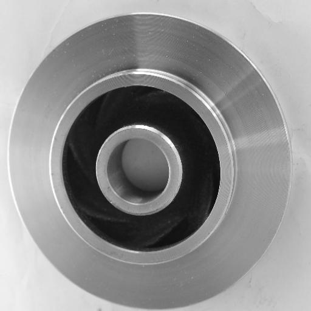
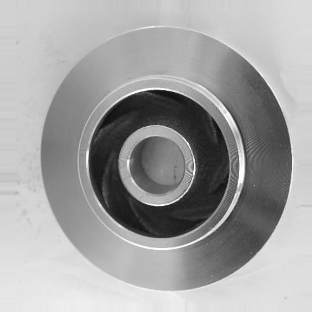
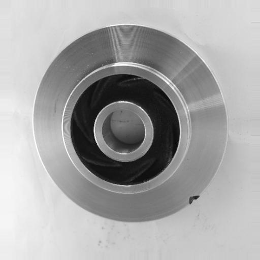
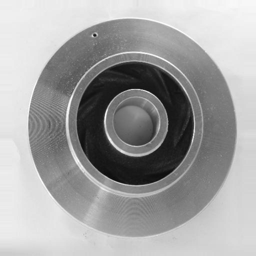
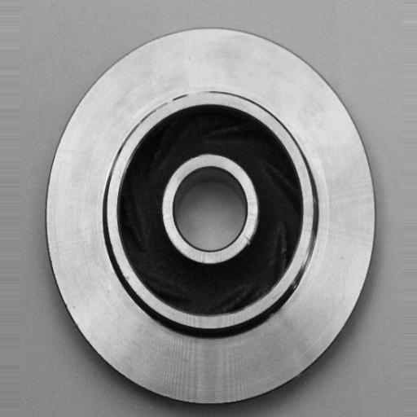
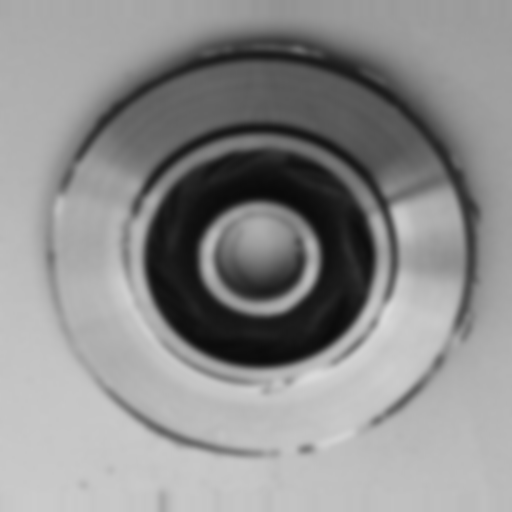
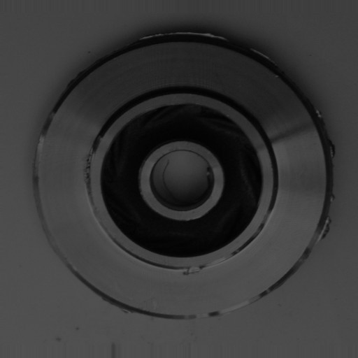

# Example predictions

Images are from the held-out **test split**. Responses were produced by `POST /predict` of the API with the shipped model (`scripts/make_examples.py`).

| image | ground truth | predicted | confidence | P(defective) | requires_review | quality_warnings | outcome |
|---|---|---|---|---|---|---|---|
|  `normal__cast_ok_0_1362.jpeg` | normal | **normal** | 0.9966 | 0.0034 | False | – | TN |
|  `normal__cast_ok_0_8974.jpeg` | normal | **normal** | 0.9939 | 0.0061 | False | – | TN |
|  `defective__cast_def_0_6112.jpeg` | defective | **defective** | 0.9806 | 0.9806 | False | – | TP |
|  `defective__cast_def_0_2950.jpeg` | defective | **defective** | 0.9776 | 0.9776 | False | – | TP |
|  `defective__cast_def_0_1139.jpeg` | defective | **defective** | 0.9059 | 0.9059 | False | – | TP |
|  `normal__cast_ok_0_6055.jpeg` | normal | **normal** | 0.9642 | 0.0358 | False | – | TN |
|  `defective__blurred_r3.png` | defective | **defective** | 0.9680 | 0.9680 | True | image_blurry (sharpness 17 < 93) | synthetic degradation of cast_def_0_6112.jpeg |
|  `defective__underexposed_x0.4.png` | defective | **defective** | 0.9396 | 0.9396 | True | image_blurry (sharpness 39 < 93); exposure_out_of_range (mean 56 not in [107, 181]) | synthetic degradation of cast_def_0_6112.jpeg |
